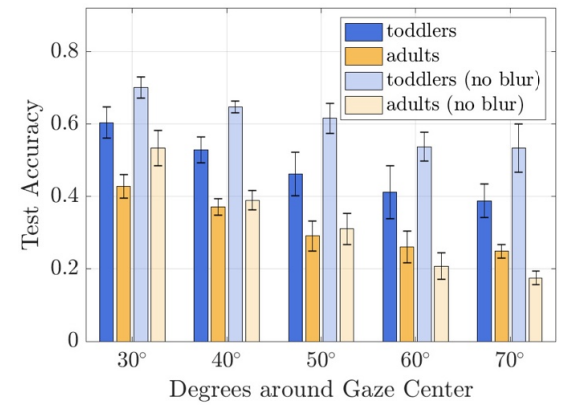
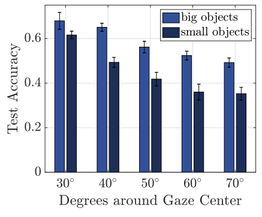
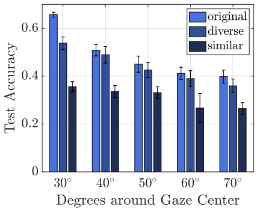

```{r setup, include=FALSE}
knitr::opts_chunk$set(echo = FALSE, 
                      comment = NA, 
                      warning = FALSE, 
                      message = FALSE,
                      fig.lp = '')

options(xtable.comment = FALSE, 
        xtable.table.placement = 'H')

library(ggplot2)
import::from(magrittr, `%>%`)
theme_set(theme_bw())

z <- 1
```

```{r data_ingest}
dogs.diversity.path <- 
  '~/dev/da-project/misc/stanford-dogs/results-diversity.csv'
dogs.size.path <- 
  '~/dev/da-project/misc/stanford-dogs/results-size.csv'
dogs.diversity.df <- readr::read_csv(dogs.diversity.path)
dogs.size.df <- readr::read_csv(dogs.size.path)


cifar10.path <- '~/dev/da-project/cifar-results.csv'
mnist.path <- '~/dev/da-project/mnist-results.csv'
cifar10.small.path <- '~/dev/da-project/cifar-results-small-data.csv'
mnist.small.path <- '~/dev/da-project/mnist-results-small-data.csv'
cifar10.df <- readr::read_csv(cifar10.path)
mnist.df <- readr::read_csv(mnist.path)
cifar10.small.df <- readr::read_csv(cifar10.small.path)
mnist.small.df <- readr::read_csv(mnist.small.path)
cifar10.df <- dplyr::bind_rows(cifar10.df, cifar10.small.df)
mnist.df <- dplyr::bind_rows(mnist.df, mnist.small.df)


cifar10.val.from.train.path <- file.path('~/dev/da-project',
                                         'subset-validation-from-training',
                                         'cifar10-constrained-val-results.csv')
mnist.val.from.train.path <- file.path('~/dev/da-project', 
                                       'subset-validation-from-training',
                                       'mnist-constrained-val-results.csv')
cifar10.val.from.train.df <- readr::read_csv(cifar10.val.from.train.path)
mnist.val.from.train.df <- readr::read_csv(mnist.val.from.train.path)

cifar10.edited.path <- file.path(
  '~/dev/da-project',
  'edited-training-data', 
  'cifar10-edited5nn-training-results.csv')
cifar10.edited.df <- readr::read_csv(cifar10.edited.path)

cifar10.clustered.path <- 
  '~/dev/da-project/kmeans-sampling/cifar10-kmeans-results.csv'
cifar10.clustered.df <- readr::read_csv(cifar10.clustered.path)
cifar10.clustered.edited.path <- 
  '~/dev/da-project/kmeans-sampling/cifar10-kmeans-edited-results.csv'
cifar10.clustered.edited.df <- readr::read_csv(cifar10.clustered.edited.path)

cifar10.transfer.path <- file.path(
  '~/dev/da-project/transfer-learning',
  'cifar10-transfer-learning-results.csv')
cifar10.transfer.edit.path <- file.path(
  '~/dev/da-project/transfer-learning',
  'cifar10-transfer-learning-edited-results.csv')
cifar10.transfer.cluster.path <- file.path(
  '~/dev/da-project/transfer-learning',
  'cifar10-transfer-learning-kmeans-results.csv')
cifar10.transfer.edit.cluster.path <- file.path(
  '~/dev/da-project/transfer-learning',
  'cifar10-transfer-learning-edited-kmeans-results.csv')
cifar10.translearn.df <- dplyr::bind_rows(
  readr::read_csv(cifar10.transfer.path),
  readr::read_csv(cifar10.transfer.edit.path) %>% 
    dplyr::filter(train_set_type != 'similar') %>% 
    dplyr::mutate(train_set_type = ifelse(train_set_type == 'random',
                                          'random', 
                                          'diverse with editing')),
  readr::read_csv(cifar10.transfer.cluster.path) %>% 
    dplyr::filter(train_set_type != 'diverse by cluster') %>% 
    dplyr::mutate(train_set_type = ifelse(train_set_type == 'random',
                                          'random',
                                          'by cluster')),
  readr::read_csv(cifar10.transfer.edit.cluster.path) %>% 
    dplyr::filter(train_set_type != 'diverse by cluster') %>% 
    dplyr::mutate(train_set_type = ifelse(train_set_type == 'random',
                                          'random',
                                          'edited and by cluster'))
) %>% 
  dplyr::filter(train_size <= 500)
```

# Background: Image Classification

* Most predictive modeling involves some sort of $n \times p$ data matrix
    * Observations typically thought of as points in $\mathbb{R}^k$
* Image data are harder to think of in terms of data matrices and Euclidean 
space
* Maybe use pixel values as features
    * Extremely high dimensional
        * Maybe can exploit spatial correlation to reduce number of dimensions
    * Doesn't account for image transformations such as translation or rotation
* Image classification (object/scene detection) doesn't fit well into 
traditional predictive modeling frameworks

# Background: Convolutional Neural Networks

* Most neural networks are "fully connected", i.e., each node of a layer is 
connected to every node of the previous layer and every node of the next layer
* Convolutional layers are locally connected, i.e., nodes point to small, 
spatially connected groups of nodes
* Accounts for localized features (e.g., edge detection)
* CNNs often outperform other image classification methods (but their 
complexity requires large training sets)

::: columns

:::: column
```{r, out.width = '50%', fig.align = 'center'}
knitr::include_graphics('~/dev/da-project/images/wikipedia-nn.png')
```
::::

:::: column
```{r, out.width = '100%', fig.align = 'center'}
knitr::include_graphics('~/dev/da-project/images/lecun-cnn.png')
```
::::

:::

\begin{flushright}
\tiny Sources: Wikipedia, LeCun et al.
\end{flushright}

# Problem Statement and Objective

> - Deep convolutional neural networks make use of the current wealth of 
curated image datasets and computational resources

> - CNNs may fit poorly when there is insufficient data, and the data 
collection and labelling process can be expensive

> - **Main question**: Is it possible to successfully train a neural network 
with a small number of carefully selected images?

> - Largely based on "Toddler-Inspired Visual Object Learning" by Bambach, 
Crandall, Smith, and Yu (2018)

# Background: "Toddler-Inspired Visual Object Learning"

* Collected two samples of images:
    * Taken from first-person cameras mounted on toddlers
    * Taken from first-person cameras mounted on adults
* Task: Identify which objects (toys) are in the images
* Training VGG16 using toddler data resulted in higher test accuracy
than training on parent data (same test set in both cases)

```{r, out.width = '37.5%', fig.align = 'center'}

```

\begin{flushright}
\tiny Figures from Toddler paper
\end{flushright}

# Background: "Toddler-Inspired Visual Object Learning"

* Identified two characteristics of images from the toddler set vs. the 
adult set:
    * Objects in images from the toddler sample typically occupied more of the 
    frame compared to objects in images from the adult sample
    * The toddler sample tended to be more "diverse" than the adult sample
    
# Background: "Toddler-Inspired Visual Object Learning"

* Two experiments performed based on object size and sample diversity
    * Find a subsample of big objects and a subsample of small objects, and 
    train VGG16 on each. Determine which model attains a higher test accuracy.
        * Object "size" defined by determining how much of the image a bounding 
        box drawn around the object takes up
    * Find a heterogeneous subsample and a homogeneous subsample, and train 
    VGG16 on each. Determine which model attains a higher test accuracy. 
        * Subsample "diversity" determined by pairwise distances of an image 
        embedding (GIST features)

# Background: "Toddler-Inspired Visual Object Learning"

* Results consistent with intuition
    * Subsample of big objects resulted in better models than subsample of 
    small objects
    * Heterogeneous subsample resulted in better models than homogeneous 
    subsample

::: columns

:::: column
```{r, out.width = '100%', fig.align = 'center'}

```
::::

:::: column
```{r, out.width = '100%', fig.align = 'center'}

```
::::

:::

\begin{flushright}
\tiny Figures from Toddler paper
\end{flushright}

# Outline and Summary

> 1. Applying the Toddler study to additional datasets

> 2. Overview of some other ways to select training sets

> 3. Conclusions and future work

# Reproduction Study: Stanford Dogs dataset

* ~20,000 images of 120 dog breeds
* 100 images per breed set aside for training
    * further subdivided into 50-50 big/small or diverse/similar
* 25 images per breed set aside for validation
* Remainder for testing

::: columns

:::: column
```{r, out.width = '50%', fig.align = 'center'}
knitr::include_graphics('~/dev/da-project/images/n02113799_2248.jpg')
```
::::

:::: column
```{r, out.width = '50%', fig.align = 'center'}
knitr::include_graphics('~/dev/da-project/images/n02115641_8578.jpg')
```
::::

::: 

# Reproduction Study: Stanford Dogs dataset

::: columns

:::: column
```{r dogs_size}
dogs.size.df %>% 
  dplyr::mutate(size = ifelse(size == 'high', 'big', 'small')) %>% 
  dplyr::group_by(fov, size) %>% 
  dplyr::summarise(mean.acc = mean(accuracy),
                   sd.acc = sd(accuracy)) %>% 
  ggplot() + 
  scale_colour_brewer(palette = 'Set1') + 
  geom_line(aes(x = fov, y = mean.acc, colour = size),
            size = 2) + 
  geom_errorbar(aes(x = fov, 
                    ymin = mean.acc - z * sd.acc, 
                    ymax = mean.acc + z * sd.acc, 
                    colour = size),
                width = 1,
                size = 2) + 
  labs(x = 'field of view', 
       y = 'test accuracy', 
       colour = NULL) + 
  theme(legend.key.width = unit(5, 'mm'),
        text = element_text(size = 32),
        legend.position = c(.8, .25),
        legend.background = element_blank()) + 
  ylim(0, .3)
```
::::

:::: column
```{r dogs_diverse}
dogs.diversity.df %>% 
  dplyr::group_by(fov, train_set_type) %>% 
  dplyr::summarise(mean.acc = mean(accuracy),
                   sd.acc = sd(accuracy)) %>% 
  ggplot() + 
  scale_colour_brewer(palette = 'Set1') + 
  geom_line(aes(x = fov, y = mean.acc, colour = train_set_type), 
            size = 2) + 
  geom_errorbar(aes(x = fov, 
                    ymin = mean.acc - z * sd.acc, 
                    ymax = mean.acc + z * sd.acc, 
                    colour = train_set_type),
                width = 1, 
                size = 2) + 
  labs(x = 'field of view', 
       y = 'test accuracy', 
       colour = NULL) + 
  theme(legend.key.width = unit(5, 'mm'),
        text = element_text(size = 32),
        legend.position = c(.8, .25),
        legend.background = element_blank()) + 
  ylim(0, .3)
```
::::

:::

# Reproduction Study: CIFAR-10

CIFAR-10

* $32 \times 32$ RGB images of 10 different object classes
* 5,000 training and 1,000 testing images per class
* No bounding box information
    * Diversity experiment only
    * No adjusting field of view

Sampling method

1. Choose training size $n$
2. Draw $2 n$ images using diverse, similar, or random sampling
3. Split the data in half for training and validation 
    * Validation set used to determine when to stop training
4. Fit VGG16 and assess accuracy on the test set

# Reproduction Study: CIFAR-10

```{r cifar10_classes, out.width = '75%', fig.align = 'center'}
knitr::include_graphics('~/dev/da-project/images/cifar-10.png')
```
\begin{flushright}
\tiny Source: https://www.cs.toronto.edu/\textasciitilde kriz/cifar.html
\end{flushright}

# Diverse vs. Similar vs. Random Samples of CIFAR-10 Cats

```{r out.width = '75%', fig.align = 'center'}
knitr::include_graphics('~/dev/da-project/images/diverse-cats.png')
```

```{r out.width = '75%', fig.align = 'center'}
knitr::include_graphics('~/dev/da-project/images/similar-cats.png')
```

```{r out.width = '75%', fig.align = 'center'}
knitr::include_graphics('~/dev/da-project/images/random-cats.png')
```

# Replication Study: CIFAR-10

```{r cifar10_diversity}
cifar10.val.from.train.df %>% 
  dplyr::group_by(train_size, train_set_type) %>% 
  dplyr::summarise(mean.acc = mean(accuracy),
                   sd.acc = sd(accuracy)) %>% 
  ggplot() + 
  scale_x_log10() + 
  # scale_y_log10() + 
  geom_line(aes(x = train_size, y = mean.acc, colour = train_set_type),
            size = 1) + 
  scale_colour_brewer(palette = 'Set1') + 
  geom_errorbar(aes(x = train_size, 
                    ymin = mean.acc - z * sd.acc, 
                    ymax = mean.acc + z * sd.acc, 
                    colour = train_set_type),
                size = 1) + 
  labs(x = 'training set size per class', 
       y = 'test accuracy',
       colour = NULL) + 
  theme(legend.key.width = unit(5, 'mm'),
        text = element_text(size = 24),
        legend.position = c(.85, .25),
        legend.background = element_blank())
```

# New Approaches to Training Set Selection

```{r pipeline, fig.align = 'center', out.width = '75%'}
knitr::include_graphics('~/dev/da-project/images/pipeline.png')
```

# Wilson Editing

* Originally developed for $k$-nearest neighbors

* Algorithm

    1. Start with a sample $X_1, ..., X_n \in \mathbb{R}^p$ and corresponding 
    discrete labels $Y_1, ..., Y_n \in \{1, ..., q\}$
    2. For $i = 1, ..., n$, determine $\hat{Y}_i$ using leave-one-out 
    cross-validated $k$-nearest neighbors classification
    3. Discard $i \in \{1, ..., n\}$ where $Y_i \neq \hat{Y}_i$ to construct a 
    reduced, "edited" training set
    4. Use the edited training set to fit a new $k$-nearest neighbors model

* Outperforms "unedited" $k$-nearest neighbors (comparing risk on a held-out 
test set)

# Wilson Editing

* Method

    1. Use Wilson editing (using the GIST embedding) to reduce the training set 
    2. For a training size $n$, draw a diverse sample from the edited training 
    set
    3. Fit VGG16 on the diverse, edited training subset
    4. Assess model performance on the test set

* Idea: Draw a diverse sample while excluding "outliers"

# Diverse Sample vs. Diverse Sample After Wilson Editing

```{r out.width = '75%', fig.align = 'center'}
knitr::include_graphics('~/dev/da-project/images/diverse-cats.png')
```

```{r out.width = '75%', fig.align = 'center'}
knitr::include_graphics('~/dev/da-project/images/diverse-edited-cats.png')
```

# Wilson Editing

::: columns

:::: column
Editing done prior to drawing diverse samples

```{r cifar10_edited}
cifar10.edited.df %>% 
  dplyr::group_by(train_size, train_set_type) %>% 
  dplyr::summarise(mean.acc = mean(accuracy),
                   sd.acc = sd(accuracy)) %>% 
  ggplot() + 
  scale_x_log10() + 
  # scale_y_log10() + 
  geom_line(aes(x = train_size, y = mean.acc, colour = train_set_type),
            size = 2) + 
  scale_colour_brewer(palette = 'Set1') + 
  geom_errorbar(aes(x = train_size, 
                    ymin = mean.acc - z * sd.acc, 
                    ymax = mean.acc + z * sd.acc, 
                    colour = train_set_type),
                size = 2) + 
  labs(x = 'training set size per class', 
       y = 'test accuracy',
       colour = NULL) + 
  theme(legend.key.width = unit(5, 'mm'),
        text = element_text(size = 32),
        legend.position = c(.85, .2),
        legend.background = element_blank()) + 
  ylim(.1, .8)
```
::::

:::: column
Effect of editing prior to drawing diverse samples

```{r edited_vs_unedited}
cifar10.edited.df %>% 
  dplyr::filter(train_set_type == 'diverse') %>% 
  dplyr::inner_join(cifar10.val.from.train.df, 
                    by = c('train_size', 'train_set_type')) %>%
  dplyr::group_by(train_size) %>% 
  dplyr::summarise(mean.acc = mean(accuracy.y), 
                   mean.acc.edited = mean(accuracy.x),
                   sd.acc = sd(accuracy.y), 
                   sd.acc.edited = sd(accuracy.x)) %>% 
  ggplot() + 
  scale_x_log10() + 
  scale_colour_brewer(palette = 'Set1') + 
  geom_line(aes(x = train_size, y = mean.acc, colour = 'not edited'),
            size = 2) + 
  geom_line(aes(x = train_size, y = mean.acc.edited, colour = 'edited'),
            size = 2) + 
  geom_errorbar(aes(x = train_size, 
                    ymin = mean.acc - z * sd.acc,
                    ymax = mean.acc + z * sd.acc, 
                    colour = 'not edited'),
                size = 2) + 
  geom_errorbar(aes(x = train_size, 
                    ymin = mean.acc.edited - z * sd.acc.edited, 
                    ymax = mean.acc.edited + z * sd.acc.edited, 
                    colour = 'edited'),
                size = 2) + 
  labs(x = 'training set size per class', y = 'test accuracy', 
       colour = NULL) + 
  theme(legend.key.width = unit(5, 'mm'),
        text = element_text(size = 32),
        legend.position = c(.85, .2),
        legend.background = element_blank()) + 
  ylim(.1, .8)
```
::::

:::

# Clustering

::: columns

:::: column
Algorithm

1. Use $k$-means clustering (using the GIST embedding) to split each class 
into "subclasses"
2. For a training size $n$, draw a cluster/subclass-stratified sample
3. Fit VGG16 on the stratified training subset
4. Assess model performance on the test set
::::

:::: column
```{r cifar10_clustered}
cifar10.clustered.df %>% 
  dplyr::filter(train_set_type != 'diverse by cluster') %>% 
  dplyr::mutate(train_set_type = ifelse(train_set_type == 'random', 
                                        'random', 'by cluster')) %>% 
  dplyr::group_by(train_size, train_set_type) %>% 
  dplyr::summarise(mean.acc = mean(accuracy),
                   sd.acc = sd(accuracy)) %>% 
  ggplot() + 
  scale_x_log10() +
  # scale_y_log10() + 
  geom_line(aes(x = train_size, y = mean.acc, colour = train_set_type),
            size = 2) + 
  scale_colour_brewer(palette = 'Set1') + 
  geom_errorbar(aes(x = train_size, 
                    ymin = mean.acc - z * sd.acc, 
                    ymax = mean.acc + z * sd.acc, 
                    colour = train_set_type),
                size = 2) + 
  labs(x = 'training set size per class', 
       y = 'test accuracy',
       colour = NULL) + 
  theme(legend.key.width = unit(5, 'mm'),
        text = element_text(size = 32),
        legend.position = c(.8, .25),
        legend.background = element_blank())
```
::::

:::

# Summary and Conclusions

::: columns

:::: column
* Diverse sampling outperforms similar sampling but fails to improve upon 
uniform random sampling
* Removing outlier images prior to drawing a diverse sample seems to improve 
model performance
* Cluster-stratified sampling resulted in equivalent model performance as 
uniform random sampling
* Future work
    * More sophisticated clustering methods
    * Active learning based approaches
::::

:::: column
Comparison of sampling methods
```{r compare}
cifar10.val.from.train.df %>% 
  dplyr::bind_rows(
    cifar10.edited.df %>%
      dplyr::filter(train_set_type %in% c('diverse', 'random')) %>%
      dplyr::mutate(train_set_type = ifelse(train_set_type == 'random', 
                                            'random', 
                                            'diverse with editing'))) %>%
  dplyr::bind_rows(
    cifar10.clustered.df %>%
      dplyr::filter(train_set_type %in% c('random by cluster', 'random')) %>%
      dplyr::mutate(train_set_type = ifelse(train_set_type == 'random', 
                                            'random', 'by cluster'))) %>%
  dplyr::bind_rows(
    cifar10.translearn.df %>% 
      dplyr::filter(train_set_type %in% c('random by cluster', 'random')) %>% 
      dplyr::mutate(train_set_type = ifelse(train_set_type == 'random', 
                                            'random', 'transfer learning'))) %>%
  dplyr::group_by(train_size, train_set_type) %>%
  dplyr::summarise(mean.acc = mean(accuracy),
                   sd.acc = sd(accuracy)) %>%
  dplyr::filter(train_size %in% c(10, 20, 40, 60, 80, 
                                  100, 200, 250, 500)) %>% 
  dplyr::mutate(train_set_type = factor(train_set_type, 
                                        levels = c('diverse', 
                                                   'similar',
                                                   'random',
                                                   'diverse with editing', 
                                                   'by cluster',
                                                   'transfer learning'))) %>% 
  ggplot() + 
  scale_x_log10() +
  # scale_y_log10() + 
  geom_line(aes(x = train_size, y = mean.acc, colour = train_set_type),
            size = 2) + 
  scale_colour_brewer(palette = 'Set1') + 
  geom_errorbar(aes(x = train_size, 
                    ymin = mean.acc - z * sd.acc, 
                    ymax = mean.acc + z * sd.acc, 
                    colour = train_set_type,
                    fill = train_set_type),
                width = .05,
                size = 2) + 
  labs(x = 'training set size per class', 
       y = 'test accuracy',
       colour = NULL) + 
  theme(legend.key.width = unit(5, 'mm'),
        text = element_text(size = 32),
        legend.position = c(.8, .2),
        legend.background = element_blank())
```
::::

:::

# Supplemental Slides

# VGG16

```{r fig.align = 'center', out.width = '75%'}
knitr::include_graphics('~/dev/da-project/images/vgg16.png')
```

\begin{flushright}
\tiny Source: Simonyan and Zisserman
\end{flushright}

# GIST Embedding

# Autoencoders

# Transfer Learning

::: columns

:::: column

* CNNs can be thought of as supervised image embedding methods
    * Second to last layer should be a linearly separable embedding
* Pretrained Xception model (~80\% accuracy on CIFAR-10)
    * Xception embedding results in ~80\% accuracy using $k$-NN
    * Can be thought of as an ideal case for embedding CIFAR-10

::::

:::: column

* Diverse sampling on Xception embedding still results in worse performance 
than random sampling

```{r, fig.align = 'center'}
cifar10.translearn.df %>% 
  dplyr::filter(train_set_type != 'similar') %>%
  dplyr::group_by(train_size, train_set_type) %>% 
  dplyr::summarise(mean.acc = mean(accuracy),
                   sd.acc = sd(accuracy)) %>% 
  dplyr::mutate(
    train_set_type = factor(train_set_type, 
                            levels = c('diverse', 
                                       'random',
                                       'diverse with editing', 
                                       'by cluster', 
                                       'edited and by cluster'))) %>% 
  ggplot() + 
  scale_x_log10() +
  # scale_y_log10() + 
  geom_line(aes(x = train_size, y = mean.acc, colour = train_set_type),
            size = 2) + 
  scale_colour_brewer(palette = 'Set1') + 
  geom_errorbar(aes(x = train_size, 
                    ymin = mean.acc - z * sd.acc, 
                    ymax = mean.acc + z * sd.acc, 
                    colour = train_set_type),
                size = 2) + 
  labs(x = 'training set size per class', 
       y = 'test accuracy',
       colour = NULL) + 
  theme(legend.key.width = unit(5, 'mm'),
        text = element_text(size = 32),
        legend.position = c(.75, .2),
        legend.background = element_blank())
```

::::

:::